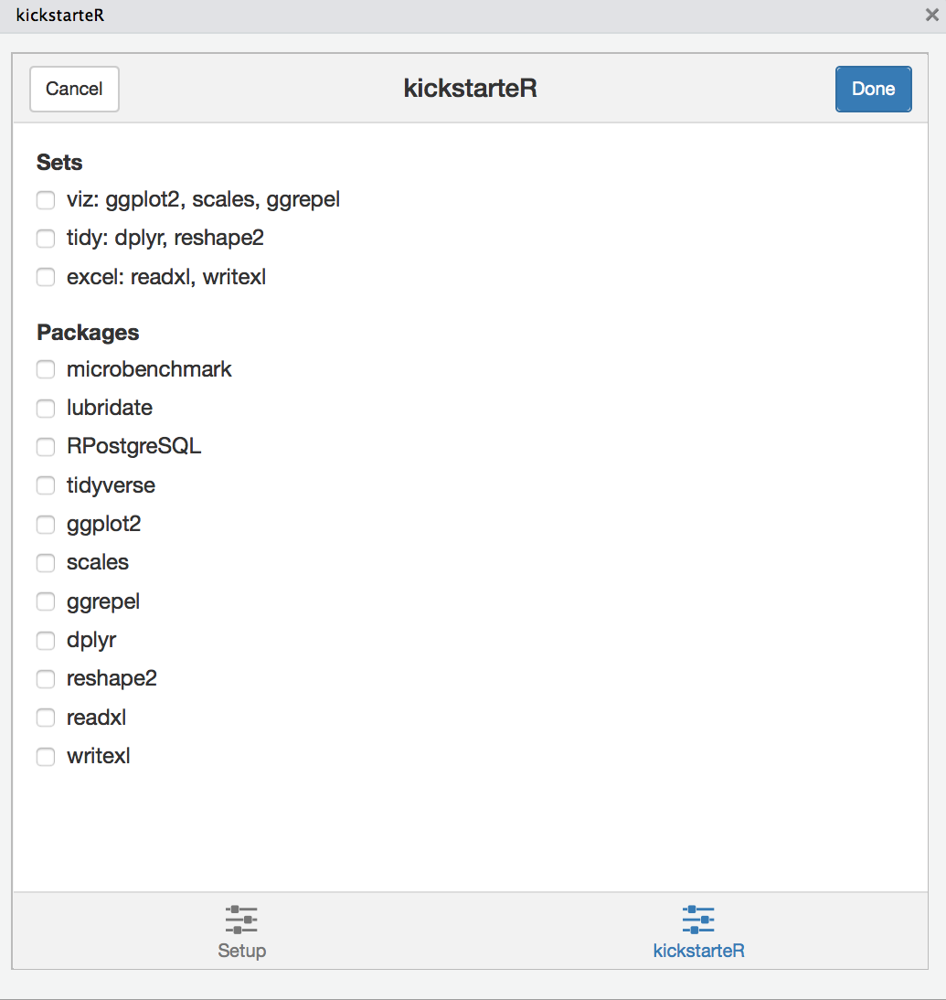

kickstarteR
==============
[](https://travis-ci.org/calligross/kickstarteR)
[](http://cran.rstudio.com/package=kickstarteR) [](http://www.r-pkg.org/pkg/kickstarteR)

`kickstarteR` is an add-in to insert library calls for often used packages in your R scripts.

Installation
------------

```r
if (!requireNamespace("devtools", quietly = TRUE))
  install.packages("devtools")

devtools::install_github("calligross/kickstarteR")
```

Usage
------------

The packages kickstarteR offers depend on the settings of the option `kickstarteR.setup` and could e.g. be stored in your `.Rprofile`. 

```r
options(
  kickstarteR.setup = list(
    packages = c('microbenchmark', 'lubridate', 'RPostgreSQL', 'tidyverse'),
    sets = list(
      viz = c('ggplot2', 'scales', 'ggrepel'),
      tidy = c('dplyr', 'reshape2'),
      excel = c('readxl', 'writexl')
    )
  )
)
```

